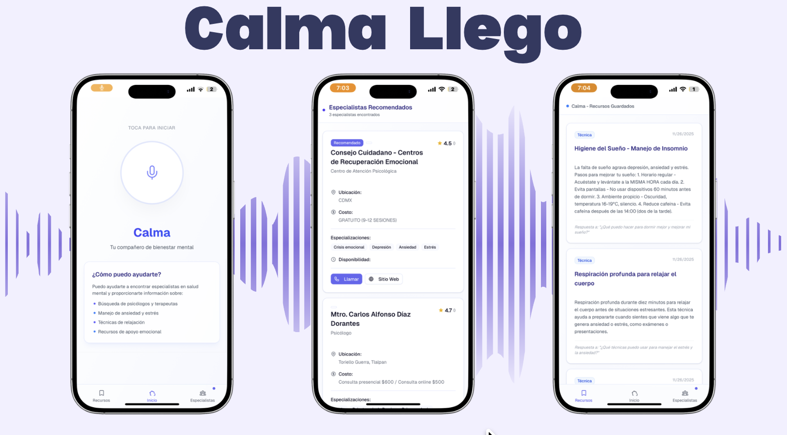

# Calma AI: Sistema RAG para Recomendación de Especialistas en Salud Mental

> *"La salud mental es un componente integral de la salud; tanto es así que no hay salud sin salud mental."*  
> — Organización Mundial de la Salud

---

## 1. Problemática

### 1.1 La Crisis Global de Salud Mental

La salud mental representa uno de los desafíos más urgentes y desatendidos de la salud pública contemporánea. Según la Organización Mundial de la Salud (OMS, 2022), aproximadamente **1 de cada 8 personas** en el mundo vive con un trastorno mental, lo que equivale a casi **mil millones de personas** afectadas globalmente. La pandemia de COVID-19 exacerbó dramáticamente esta crisis: los casos de ansiedad y depresión aumentaron en un **25%** durante el primer año de la pandemia (WHO, 2022).

### 1.2 La Brecha de Atención

A pesar de la magnitud del problema, existe una brecha crítica entre la necesidad de atención y el acceso efectivo a servicios de salud mental:

| Indicador | Estadística | Fuente |
|-----------|-------------|--------|
| Personas sin tratamiento | 75% en países de ingresos bajos/medios | OMS, 2022 |
| Tiempo promedio para buscar ayuda | 11 años desde el inicio de síntomas | NIMH, 2021 |
| Psiquiatras por 100,000 habitantes (México) | 1.6 | OPS, 2023 |
| Psiquiatras por 100,000 habitantes (USA) | 16.3 | APA, 2022 |

En **México**, la situación es particularmente alarmante:
- Solo el **2.4%** del presupuesto de salud se destina a salud mental (OPS, 2023)
- Existe **1 psiquiatra** por cada 62,500 habitantes
- El **85%** de las personas con trastornos mentales no reciben tratamiento

### 1.3 Barreras para Acceder a la Atención

Las personas que buscan ayuda profesional enfrentan múltiples obstáculos:

1. **Información fragmentada**: Los datos de especialistas están dispersos en múltiples fuentes heterogéneas, sin estandarización ni actualización consistente.

2. **Estigma social**: El estigma asociado a los trastornos mentales dificulta que las personas busquen ayuda abiertamente o pregunten a conocidos por recomendaciones.

3. **Sobrecarga cognitiva**: En momentos de crisis, la capacidad de tomar decisiones informadas se ve severamente comprometida. Evaluar múltiples opciones resulta abrumador.

4. **Falta de personalización**: Los directorios tradicionales no consideran las necesidades específicas del paciente: ubicación, presupuesto, especialidad requerida, o preferencias personales.

5. **Urgencia temporal**: En situaciones de crisis (ideación suicida, ataques de pánico), cada minuto cuenta. Los sistemas actuales no están diseñados para respuesta inmediata.

### 1.4 La Oportunidad Tecnológica

Los avances recientes en **Procesamiento de Lenguaje Natural (NLP)** y **sistemas de recuperación de información** ofrecen una oportunidad sin precedentes para abordar estas barreras. En particular, la arquitectura **Retrieval-Augmented Generation (RAG)** permite:

- Comprender consultas en lenguaje natural (*"Necesito un psicólogo para ansiedad cerca de mi casa"*)
- Recuperar información relevante de bases de datos estructuradas
- Generar respuestas personalizadas y contextualizadas
- Escalar a grandes volúmenes de datos sin degradación de rendimiento

---

## 2. Propuesta de Solución

### 2.1 Calma AI

 

Este proyecto presenta **Calma AI**, un sistema de recomendación de especialistas en salud mental basado en Retrieval-Augmented Generation (RAG) que aborda las barreras identificadas mediante:

1. **Búsqueda semántica**: Comprensión del contexto e intención del usuario, no solo coincidencia de palabras clave.

2. **Personalización multi-criterio**: Consideración de ubicación, presupuesto, especialidad, disponibilidad y preferencias del usuario.

3. **Detección de crisis**: Identificación automática de situaciones de emergencia con escalamiento apropiado.

4. **Accesibilidad**: Interfaz conversacional en español con soporte de voz opcional.

5. **Escalabilidad**: Arquitectura capaz de indexar desde cientos hasta decenas de miles de especialistas.

### 2.2 Alcance del Proyecto

El sistema se implementa en dos módulos complementarios:

| Módulo | Cobertura | Especialistas | Características |
|--------|-----------|---------------|-----------------|
| **Calma App (CDMX)** | Ciudad de México | 150+ | Interfaz de voz, detección de crisis, guías clínicas |
| **NPPES Recommendations** | Estados Unidos | 60,000+ | Pipeline RAG escalable, análisis exploratorio |

---

## 3. Marco Teórico

### 3.1 Retrieval-Augmented Generation (RAG)

RAG es una arquitectura híbrida que combina las fortalezas de los sistemas de recuperación de información con modelos de lenguaje generativos (Lewis et al., 2020). A diferencia de los LLMs puros que dependen únicamente del conocimiento codificado en sus parámetros, RAG:

1. **Recupera** documentos relevantes de una base de conocimiento externa
2. **Aumenta** el contexto del prompt con esta información
3. **Genera** respuestas fundamentadas en datos actualizados

**Ventajas de RAG para este dominio:**
- Información actualizable sin reentrenamiento del modelo
- Trazabilidad de las fuentes de información
- Reducción de alucinaciones al fundamentar respuestas en datos reales
- Eficiencia computacional comparada con fine-tuning

### 3.2 Embeddings y Búsqueda Vectorial

Los embeddings son representaciones numéricas densas de texto en un espacio vectorial de alta dimensionalidad. Este proyecto utiliza el modelo `text-embedding-3-small` de OpenAI:

| Característica | Valor |
|----------------|-------|
| Dimensionalidad | 1536 |
| Métrica de similitud | Coseno |
| Normalización | L2 |

La similitud semántica entre una consulta $q$ y un documento $d$ se calcula como:

$$\text{sim}(q, d) = \frac{\mathbf{e}_q \cdot \mathbf{e}_d}{||\mathbf{e}_q|| \cdot ||\mathbf{e}_d||} = \cos(\theta)$$

Donde $\mathbf{e}_q$ y $\mathbf{e}_d$ son los vectores de embedding normalizados.

### 3.3 FAISS (Facebook AI Similarity Search)

FAISS es una biblioteca optimizada para búsqueda de similitud en espacios de alta dimensionalidad (Johnson et al., 2019). Características clave:

- **IndexFlatIP**: Producto interno exacto, óptimo para datasets < 1M vectores
- **Complejidad**: $O(n \cdot d)$ para búsqueda exacta
- **Latencia**: < 500ms para 60K+ vectores

### 3.4 Scoring Híbrido

El sistema Calma App implementa un modelo de scoring multi-criterio:

$$Score = w_1 \cdot S_{semantic} + w_2 \cdot S_{rating} + w_3 \cdot S_{cost} + w_4 \cdot S_{availability}$$

Con pesos optimizados:
- $w_1 = 0.70$ (similitud semántica)
- $w_2 = 0.15$ (calificación del especialista)
- $w_3 = 0.10$ (ajuste a presupuesto)
- $w_4 = 0.05$ (disponibilidad)

---

## 4. Arquitectura del Sistema

```
┌─────────────────────────────────────────────────────────────────────────────┐
│                           Calma AI - Arquitectura                            │
├─────────────────────────────────────────────────────────────────────────────┤
│                                                                              │
│  ┌──────────────┐     ┌──────────────┐     ┌──────────────────────────────┐ │
│  │   Frontend   │────▶│   Flask API  │────▶│      Sistemas RAG            │ │
│  │  Next.js 14  │     │  api_rest.py │     │                              │ │
│  │  + shadcn/ui │◀────│  + Gunicorn  │◀────│  ┌────────────────────────┐  │ │
│  └──────────────┘     └──────────────┘     │  │  Specialist RecSys     │  │ │
│         │                    │             │  │  retrieval_system.py   │  │ │
│         │                    │             │  │  FAISS + Hybrid Rank   │  │ │
│         ▼                    │             │  └────────────────────────┘  │ │
│  ┌──────────────┐            │             │                              │ │
│  │  ElevenLabs  │            │             │  ┌────────────────────────┐  │ │
│  │   Voice AI   │            │             │  │  Knowledge RAG         │  │ │
│  │  (Opcional)  │            │             │  │  knowledge_rag.py      │  │ │
│  └──────────────┘            │             │  │  Guías Clínicas        │  │ │
│                              │             │  └────────────────────────┘  │ │
│                              │             └──────────────────────────────┘ │
│                              ▼                           │                  │
│                    ┌──────────────────────────────────────────────────────┐ │
│                    │            Bases de Datos Vectoriales (FAISS)        │ │
│                    │  ┌─────────────────┐    ┌─────────────────────────┐  │ │
│                    │  │ faiss_recursos/ │    │ faiss_pasos/            │  │ │
│                    │  │ Especialistas   │    │ Base de Conocimiento    │  │ │
│                    │  │ CDMX (150+)     │    │ Artículos Clínicos (25+)│  │ │
│                    │  └─────────────────┘    └─────────────────────────┘  │ │
│                    └──────────────────────────────────────────────────────┘ │
│                                                                              │
├─────────────────────────────────────────────────────────────────────────────┤
│                       Módulo NPPES (USA - 60K+ Especialistas)                │
├─────────────────────────────────────────────────────────────────────────────┤
│                                                                              │
│  ┌────────────────────────┐    ┌────────────────────────────────────────┐   │
│  │  01_exploracion_datos  │    │  02_sistema_rag_nppes                  │   │
│  │  Análisis Exploratorio │    │  Pipeline RAG                          │   │
│  │  - Perfilado de datos  │───▶│  - Generación de embeddings            │   │
│  │  - Visualizaciones     │    │  - Indexación FAISS                    │   │
│  │  - Métricas de calidad │    │  - Búsqueda semántica                  │   │
│  └────────────────────────┘    │  - Clase NPPESRetrieval                │   │
│                                └────────────────────────────────────────┘   │
│                                              │                               │
│                                              ▼                               │
│                                ┌────────────────────────────────────────┐   │
│                                │  faiss_nppes/                          │   │
│                                │  - nppes_index.bin                     │   │
│                                │  - nppes_metadata.pkl                  │   │
│                                └────────────────────────────────────────┘   │
│                                                                              │
└─────────────────────────────────────────────────────────────────────────────┘
```

---

## 5. Estructura del Proyecto

```
mental-health-rag-recsys/
│
├── Calma-app/                          # Módulo Asistente CDMX
│   ├── api_rest.py                     # Servidor Flask REST API
│   ├── backend/                        # Aplicación Frontend Next.js
│   │   ├── app/                        # Páginas App Router
│   │   │   ├── page.tsx                # Interfaz de voz principal
│   │   │   ├── especialistas/          # Directorio de especialistas
│   │   │   └── recursos/               # Página de recursos
│   │   ├── components/                 # Componentes React (shadcn/ui)
│   │   └── lib/                        # Utilidades
│   ├── RAG/                            # Núcleo del sistema RAG
│   │   ├── knowledge_rag.py            # Recuperación base de conocimiento
│   │   ├── retrieval_system.py         # Recomendación de especialistas
│   │   └── ELEVENLABS_SYSTEM_PROMPT.md # Configuración Voice AI
│   └── datos/                          # Datos e índices
│       ├── recursos_salud_mental_cdmx.json
│       ├── base_conocimiento_rag_pasos_inmediatos.json
│       ├── faiss_recursos/             # Embeddings especialistas
│       └── faiss_pasos/                # Embeddings conocimiento
│
├── NPPES_recommendations/              # Módulo Especialistas USA
│   ├── 01_exploracion_datos_nppes.ipynb    # Notebook EDA
│   ├── 02_sistema_rag_nppes.ipynb          # Implementación RAG
│   ├── data/                               # Dataset NPPES
│   │   └── mental_health_specialists_cleaned.json
│   └── requirements.txt                    # Dependencias del módulo
│
├── arquitectura_proyecto.tex           # Documentación técnica (LaTeX)
├── render.yaml                         # Configuración deploy Render
├── requirements.txt                    # Dependencias globales
└── README.md
```

---

## 6. Implementación Técnica

### 6.1 Generación de Embeddings

```python
EMBEDDING_MODEL = "text-embedding-3-small"
EMBEDDING_DIMENSION = 1536

def generate_embeddings(specialists: List[Dict], batch_size: int = 50) -> np.ndarray:
    """
    Genera embeddings para lista de especialistas en batches.
    
    Args:
        specialists: Lista de diccionarios con datos de especialistas
        batch_size: Tamaño del batch para API calls
        
    Returns:
        Array numpy de embeddings normalizados
    """
    embeddings = []
    for i in range(0, len(specialists), batch_size):
        batch = specialists[i:i+batch_size]
        texts = [create_specialist_description(s) for s in batch]
        response = client.embeddings.create(
            model=EMBEDDING_MODEL,
            input=texts
        )
        embeddings.extend([d.embedding for d in response.data])
    return np.array(embeddings, dtype='float32')
```

### 6.2 Configuración del Índice FAISS

```python
def create_faiss_index(embeddings: np.ndarray) -> faiss.IndexFlatIP:
    """
    Crea índice FAISS optimizado para similitud coseno.
    
    La normalización L2 convierte el producto interno en similitud coseno.
    """
    # Normalizar para similitud coseno
    faiss.normalize_L2(embeddings)
    
    # Crear índice de producto interno
    index = faiss.IndexFlatIP(EMBEDDING_DIMENSION)
    index.add(embeddings)
    
    return index
```

### 6.3 Función de Búsqueda

```python
def search_specialists(query: str, 
                       index: faiss.IndexFlatIP, 
                       specialists: List[Dict], 
                       top_k: int = 5) -> List[Dict]:
    """
    Búsqueda semántica de especialistas.
    
    Args:
        query: Consulta en lenguaje natural
        index: Índice FAISS
        specialists: Metadatos de especialistas
        top_k: Número de resultados
        
    Returns:
        Lista de especialistas ordenados por relevancia
    """
    # Generar embedding de la consulta
    query_embedding = get_embedding(query)
    faiss.normalize_L2(query_embedding)
    
    # Buscar en FAISS
    similarities, indices = index.search(query_embedding, top_k)
    
    # Construir resultados con scores
    results = []
    for idx, sim in zip(indices[0], similarities[0]):
        specialist = specialists[idx].copy()
        specialist['similarity_score'] = float(sim)
        results.append(specialist)
    
    return results
```

---

## 7. Instalación y Configuración

### 7.1 Requisitos Previos

- Python 3.12+
- Node.js 20+ (para frontend)
- API Key de OpenAI

### 7.2 Configuración del Backend

```bash
# Clonar repositorio
git clone https://github.com/Vania-Janet/mental-health-rag-recsys.git
cd mental-health-rag-recsys

# Crear entorno virtual
python -m venv .venv
source .venv/bin/activate  # Windows: .venv\Scripts\activate

# Instalar dependencias
pip install -r requirements.txt

# Configurar variables de entorno
cp .env.example .env
# Editar .env: OPENAI_API_KEY=tu_api_key

# Ejecutar servidor
cd Calma-app
python api_rest.py
```

### 7.3 Configuración del Frontend

```bash
cd Calma-app/backend
pnpm install
pnpm dev
```

### 7.4 Módulo NPPES

```bash
cd NPPES_recommendations
python -m venv venv
source venv/bin/activate
pip install -r requirements.txt

# Ejecutar notebooks en orden:
# 1. 01_exploracion_datos_nppes.ipynb (EDA)
# 2. 02_sistema_rag_nppes.ipynb (Sistema RAG)
```

---

## 8. API REST

### Health Check

```http
GET /health
```

```json
{
  "status": "healthy",
  "retrieval_system": "loaded",
  "knowledge_rag": "loaded"
}
```

### Buscar Especialistas

```http
POST /buscar_especialista
Content-Type: application/json

{
  "sintoma": "ansiedad",
  "genero": "femenino",
  "presupuesto": "bajo",
  "ubicacion": "Benito Juárez"
}
```

### Consultar Base de Conocimiento

```http
POST /consultar_guia_medica
Content-Type: application/json

{
  "consulta": "¿Qué hago si tengo un ataque de pánico?",
  "top_k": 3
}
```

---

## 9. Métricas de Evaluación

### 9.1 Rendimiento del Sistema

| Métrica | Sistema CDMX | Sistema NPPES |
|---------|--------------|---------------|
| Registros Indexados | 150+ | 60,000+ |
| Dimensión Embeddings | 1536 | 1536 |
| Tipo de Índice | FAISS IndexFlatIP | FAISS IndexFlatIP |
| Latencia de Búsqueda | < 500ms | < 500ms |

### 9.2 Clasificación de Relevancia

| Score de Similitud | Clasificación |
|-------------------|---------------|
| >= 0.85 | Muy Alta |
| 0.75 - 0.84 | Alta |
| 0.65 - 0.74 | Media |
| < 0.65 | Baja |

---

## 10. Consideraciones Éticas

### 10.1 Protocolo de Detección de Crisis

El sistema implementa detección automática de crisis con tres niveles:

| Nivel | Indicadores | Respuesta |
|-------|-------------|-----------|
| **Crítico** | Ideación suicida, autolesiones | Recursos de emergencia inmediatos |
| **Alto** | Ataques de pánico, angustia severa | Soporte urgente + referencia |
| **Normal** | Consultas generales | Recomendaciones estándar |

### 10.2 Recursos de Emergencia (México)

- **Línea de la Vida**: 800-911-2000 (24/7, gratuito)
- **Servicios de Emergencia**: 911

### 10.3 Aviso Legal

Esta aplicación proporciona **apoyo informativo únicamente** y no constituye consejo médico. Las personas que experimenten emergencias de salud mental deben contactar servicios de emergencia inmediatamente.

---

## 11. Referencias

1. Lewis, P., Perez, E., Piktus, A., Petroni, F., Karpukhin, V., Goyal, N., ... & Kiela, D. (2020). Retrieval-Augmented Generation for Knowledge-Intensive NLP Tasks. *Advances in Neural Information Processing Systems*, 33, 9459-9474.

2. Johnson, J., Douze, M., & Jégou, H. (2019). Billion-scale similarity search with GPUs. *IEEE Transactions on Big Data*, 7(3), 535-547.

3. World Health Organization. (2022). *World Mental Health Report: Transforming Mental Health for All*. WHO.

4. OpenAI. (2024). *Embeddings Guide*. https://platform.openai.com/docs/guides/embeddings

5. CMS. (2024). *NPPES NPI Registry*. https://npiregistry.cms.hhs.gov/

6. Organización Panamericana de la Salud. (2023). *La carga de los trastornos mentales en la Región de las Américas*. OPS.

---

## 12. Stack Tecnológico

| Capa | Tecnología |
|------|------------|
| Backend | Python 3.12, Flask, Gunicorn |
| Frontend | Next.js 14, TypeScript, shadcn/ui |
| Embeddings | OpenAI text-embedding-3-small |
| Vector Search | FAISS IndexFlatIP |
| Voice AI | ElevenLabs (opcional) |
| Deployment | Render (backend), Vercel (frontend) |

---

## 13. Licencia

MIT License - Ver archivo [LICENSE](LICENSE) para detalles.

---

## 14. Autor

**Vania Janet**

Repositorio: [github.com/Vania-Janet/mental-health-rag-recsys](https://github.com/Vania-Janet/mental-health-rag-recsys)

---

*Desarrollado con el objetivo de mejorar la accesibilidad a servicios de salud mental.*
